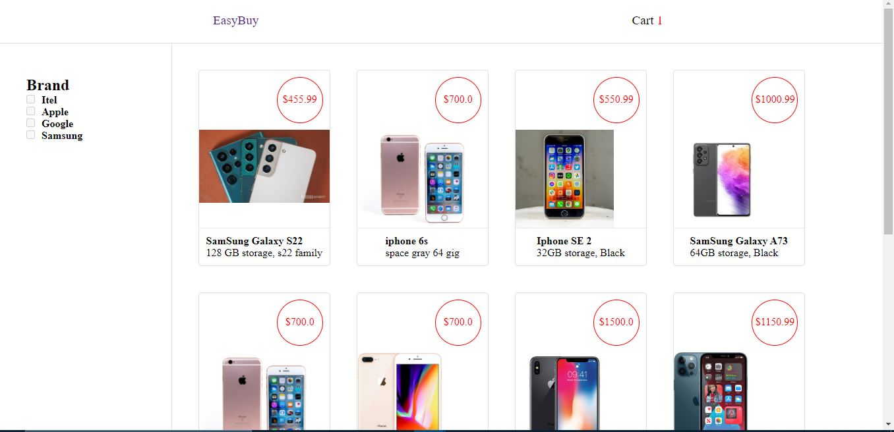
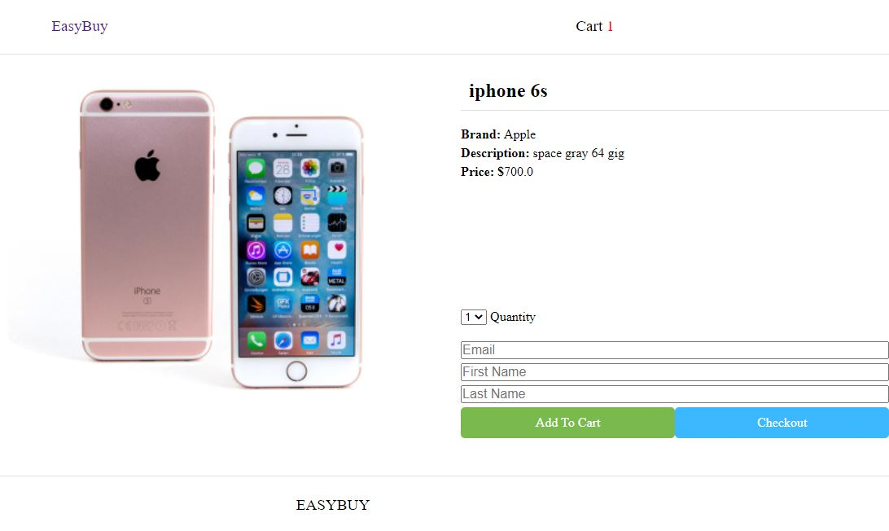
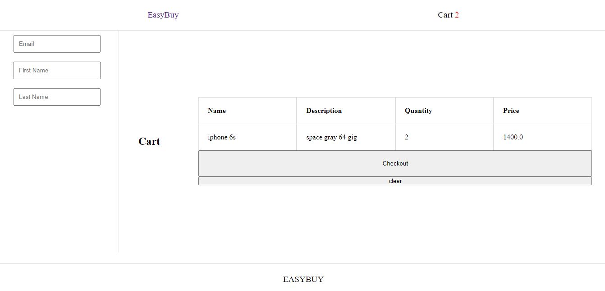
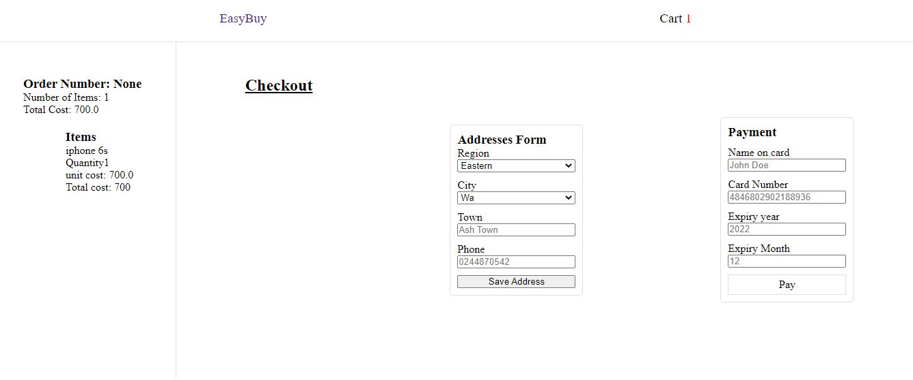
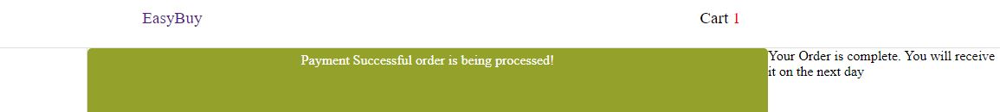

# EasyBuy (Phone shop)
---
EasyBuy is a phone shop front. I pictured a way to translate my brothers phone shop, from physical to virtual.
Customers are not expected to login to make a purchase.
The flow of the platform mimics a scenario where you visit a local phone shop.
You browse, with the option of selecting multiple items and then checking out.
You do not need an account with the shop to proceed.

In the case of EasyBuy you must provide an email, name, and address for first time buyers and only
emmail for subsequent events. it is neccessary to get these information to ship orders to the customer.
So the next time after the purchase is not going to be a hustle.
Payment is by card and its hopeful to include mobile money payment options.

The current implementation Does not really process payment is an imitation of payment.

## The Flow of Operations
---
- ### The front page allows browsing through a list of phones. Clicking on any takes you to the detail page of the phone.
-- 
- ### On the detail page two options are presented, `Add a phone to the cart and continue browsing` or `order the phone as a singleton`. either options allows specification of quantity of phone to include.
-- 
- ### If first option is choosen you make your order on the `cart page`.
-- 
- ### An order is created for the customer once the `checkout` button is clicked and page to collect your payment and address(first timers) is displayed.
-- 
- ### Customer then fills in the address information and finally pay for the order.
- ### A page is displayed about the success or failure of the payment.
-- 
- ### After successful payment order is processed and shipped.

Author: [Gideon Quainoo](https://twitter.com/gideonme)
